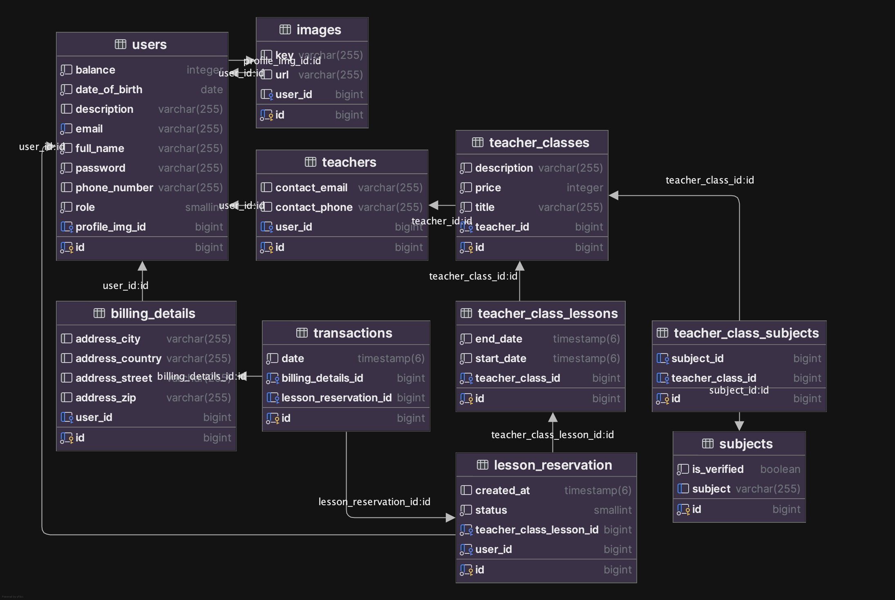

## Telepítés és futtatás ⚙️

### Követelmények
> A projekt [Spring Boot](https://spring.io/projects/spring-boot) keretrendszert használ,<br/> amihez szükséges a [Maven](https://maven.apache.org/download.cgi) telepítése.

> [JDK 17](https://bell-sw.com/pages/downloads/#jdk-17-lts) szükséges a futtatáshoz.

> PostgreSQL adatbázisunkhoz [Docker](https://www.docker.com/products/docker-desktop/) használtunk.<br/> Ennek pontos beállításához alább található [Adatbázis konfiguráció](#adatbázis-konfiguráció).
 
> A képek tárolásához [AWS S3](https://aws.amazon.com/s3/) szolgáltatást használtunk, így szükséges egy AWS fiók, illetve egy [bucket létrehozása](https://docs.aws.amazon.com/AmazonS3/latest/userguide/create-bucket-overview.html) és a [fiókhoz tartozó](https://aws.amazon.com/blogs/security/wheres-my-secret-access-key/) kulcsok generálása.

### Futattás
1. Projekt cloneozása:

```bash 
git clone https://github.com/auermatew/Progressus_Backend.git 
```


2. A már konfigurált Docker container elindítása

3. A backend projekt `src/main/resources` packagen belül `secrets.properties` fájl létrehozása melynek szükséges tartalma megtalálható a [secrets.example.properties](https://github.com/auermatew/Progressus_Backend/blob/main/src/main/resources/secrets.example.properties) fájlban.

4. Backend applikáció elindítása


### Adatbázis konfiguráció
(A Docker telepítése után) futtatni kell a backend project root mappájában található [docker-compose.yml](https://github.com/auermatew/Progressus_Backend/blob/main/docker-compose.yml) fájlt a következő paranccsal:<br/>
```bash
docker compose up -d
```
Az adatbázis dump fájl importáláshoz futtatni kell a következő parancsot:
```bash
docker exec -i progressus_database \
  psql -U user -d progressus_database \
  -f /tmp/dump.sql
```
>**Megjegyzés:** A dump fájl 3 db felhasználóval rendelkezik: 
> 
>`tesztdiak@gmail.com`, `teszttanar@gmail.com`, `tesztadmin@gmail.com` - akiknek a jelszava: `teszt123`. <br/>

**(Opcionális)**
**Adatbázis megjelenítése IntelliJ-ben:** </br>
> 1. `View > Tool Windows > Database` 
> 2. `+ ikon > Data Source > PostgreSQL`
> 3. `Host: localhost`
> 4. `Port: 5432`
> 5. `Username: user`
> 6. `Password: password`
> 7. `Apply > OK`


---
## Fejlesztési terv 👽
#### 1. Entities, adatmodell ✅
#### 2. Autentikáció JWT-vel és cookies ✅
#### 3. Autorizáció ✅
#### 4. Tanár features
   - authorization ✅
   - tanórák ✅
   - naptár ✅
#### 5. Diák - tanár interakciók
   - óra jelentkezés ✅
   - óra vétele ✅
#### 6. Egyéb funkciók
   - tantárgyak ✅
   - képek AWS-sel ✅
#### 7. Extra funkciók
   - basic admin features ✅
---
## Dokumentáció | Tesztelés 📊
> A végpontokhoz tartozó Swagger API dokumentáció a http://localhost:8080/swagger-ui/index.html URL-en érhető el az app futtatása után, mely tartalmazza a végpontok leírását, paramétereit és válaszait. <br/>

> Minden fontosabb funkciónál javadoc dokumentáció található.

> A manuális teszteléshez [Postman](https://www.postman.com/downloads/) alkalmazást használtunk. <br/>
> A hozzá tartozó Postman Collection megtalálható [Progressus.postman_collection.json](https://github.com/auermatew/Progressus_Backend/blob/main/Progressus.postman_collection.json) néven a projekt root mappájában, így a Postman alkalmazásba könnyen importálható.


> Az egységtesztek a `src/test/java/hu.progressus` mappában találhatóak, melyek mindegyikének `✅ Test passed` státusszal kell rendelkezniük.<br/>
---
## Adatbázis-modell diagram

